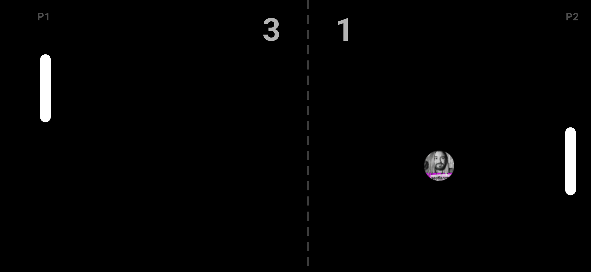

# 🏓 zaebalsya-pong


A two-player Pong game built with Flutter, designed for Android.



---

## Gameplay

Two players share one device in **landscape mode**.

| Side | Player | Control |
|------|--------|---------|
| Left | P1 | Drag the left half of the screen |
| Right | P2 | Drag the right half of the screen |

Both players can move — full multi-touch support.

---

## Features

- Smooth 60 fps game loop via Flutter `Ticker`
- Ball speed increases ~4% on every paddle hit
- Bounce angle varies based on where the ball hits the paddle
- Score tracked live at the top of the screen
- Fullscreen mode
- Forces landscape orientation on launch

---

## Controls

```
┌─────────────────────────────────────────┐
│  P1  │                         │  P2   │
│  ▌   │     ●                   │    ▐  │
│  ▌   │           ─ ─ ─         │    ▐  │
│  ▌   │                         │    ▐  │
└─────────────────────────────────────────┘
 drag left                       drag right
```
